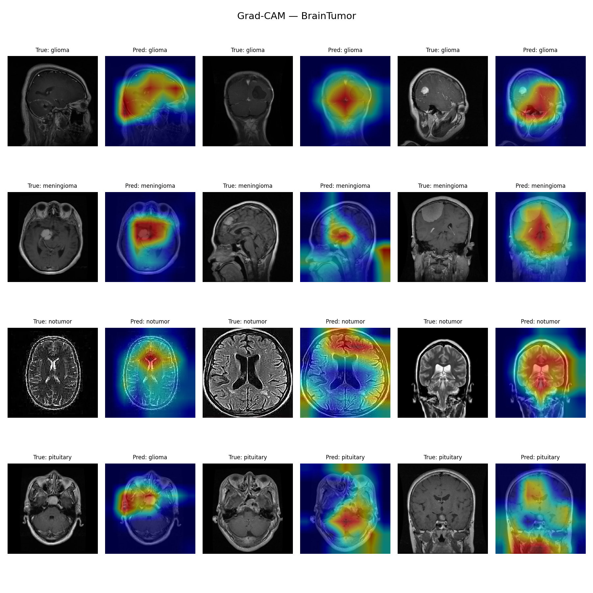
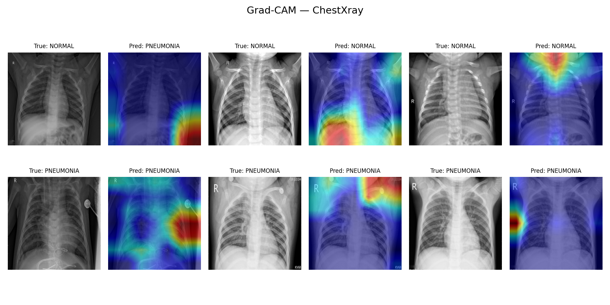
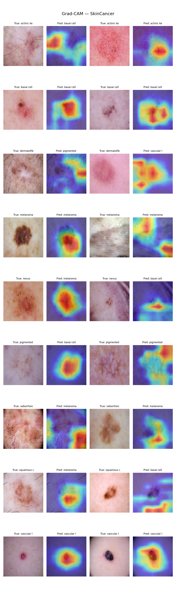
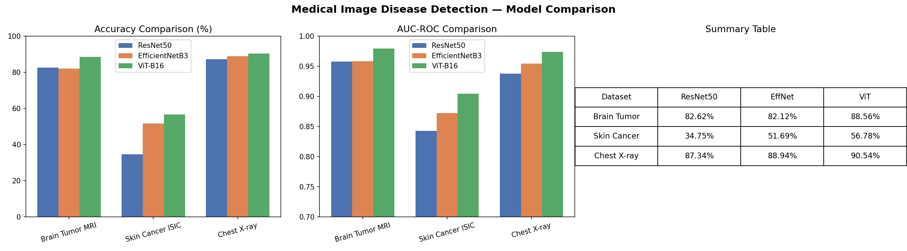

# 🧠 Medical Image Disease Detection using Deep Learning

A comparative study of **ResNet50**, **EfficientNetB3**, and **ViT-B16** for disease detection across three medical imaging domains, with **Grad-CAM explainability**.

---

## 📌 Project Overview

This project implements and compares three state-of-the-art deep learning architectures for medical image classification across three datasets:

| Dataset | Disease | Classes |
|---|---|---|
| Brain Tumor MRI | Brain Tumor Detection | 4 (Glioma, Meningioma, No Tumor, Pituitary) |
| Chest X-ray | Pneumonia Detection | 2 (Normal, Pneumonia) |
| Skin Cancer ISIC | Skin Lesion Classification | 9 (Melanoma, Basal Cell, etc.) |

---

## 🏗️ Architectures

| Model | Type | Key Innovation |
|---|---|---|
| ResNet50 | CNN | Skip connections, 50 layers |
| EfficientNetB3 | CNN | Compound scaling |
| ViT-B16 | Transformer | Self-attention on image patches |

All models use **transfer learning** (ImageNet pretrained weights) with frozen backbones and custom classification heads.

---

## 📊 Results

### Accuracy Comparison

| Dataset | ResNet50 | EfficientNetB3 | ViT-B16 |
|---|---|---|---|
| Brain Tumor MRI | 82.62% | 82.12% | **88.56%** |
| Skin Cancer ISIC | 34.75% | 51.69% | **56.78%** |
| Chest X-ray | 87.34% | 88.94% | **90.54%** |

### AUC-ROC Comparison

| Dataset | ResNet50 | EfficientNetB3 | ViT-B16 |
|---|---|---|---|
| Brain Tumor MRI | 0.9578 | 0.9585 | **0.9799** |
| Skin Cancer ISIC | 0.8432 | 0.8725 | **0.9048** |
| Chest X-ray | 0.9383 | 0.9548 | **0.9740** |

> ViT-B16 consistently outperforms CNN-based architectures across all datasets and metrics.

---

## 🔍 Explainability — Grad-CAM

Gradient-weighted Class Activation Mapping (Grad-CAM) visualizations show which regions the model focuses on for its predictions.

- **Brain Tumor** — heatmaps highlight tumor regions in MRI scans
- **Chest X-ray** — heatmaps focus on lung regions for pneumonia detection  
- **Skin Cancer** — heatmaps center on lesion boundaries

---

## 🛠️ Tech Stack

- **Framework:** PyTorch
- **Models:** torchvision (ResNet50, EfficientNetB3, ViT-B16)
- **Explainability:** Grad-CAM
- **Training:** Google Colab / Kaggle (GPU)
- **Evaluation:** scikit-learn

---

## 📁 Project Structure
### Brain Tumor

### Chest X-ray

### Skin Cancer

### Final Dashboard

